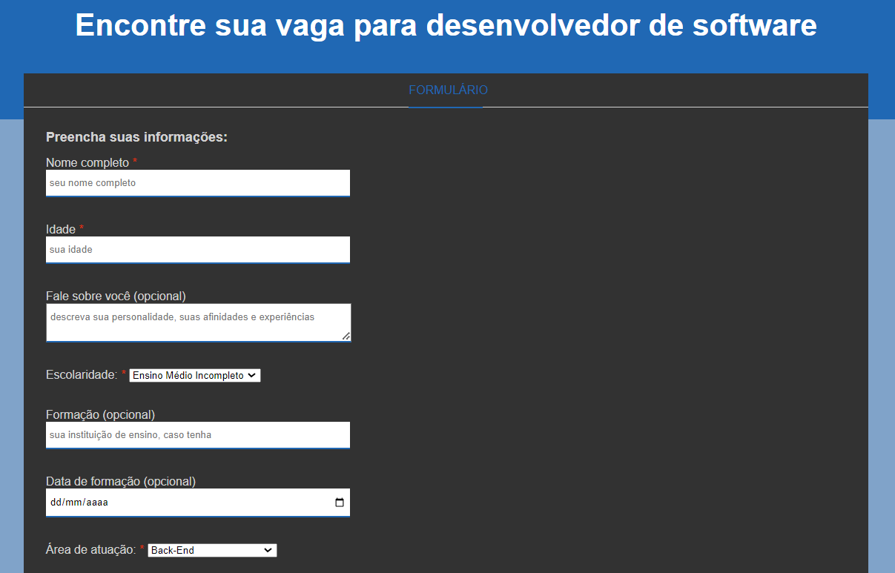

  

## Overview

- This project is an HTML page featuring a hypothetical form designed to help users find developer job vacancies
- It includes various input fields such as name, age, description, education, degree, etc.

  

## Features

- Input fields for user information
- Utilization of various HTML form elements and input types

## Installation and Usage

To view the tribute page locally, follow these steps:

1. Download this repository
2. Open the index.html file in your preferred web browser

## License

This project is licensed under the MIT License. See the [LICENSE](LICENSE) file for details.
